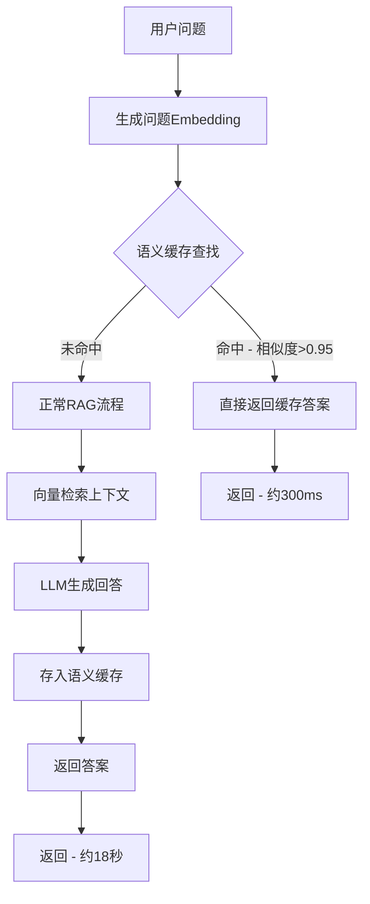

# AI 回复速度语义缓存优化方案

## 当前性能分析

当前一次完整的 AI 回复耗时约 18-28 秒，主要瓶颈：

| 步骤 | 本地耗时 | 生产耗时 | 说明 |

|------|---------|---------|------|

| API 解析 + DB 查询 | ~0.2s | ~0.5s | Supabase 查询 |

| 向量检索 | ~0.8s | ~1.5s | Embedding 生成 + pgvector 查询 |

| **LLM 生成回答** | **~8-12s** | **~15-20s** | gpt-4o 模型 + 上下文 |

| follow-up 问题 | ~2-3s | ~4-6s | 查询扩展 + 二次验证 |

| **网络延迟** | - | ~3-5s | 多次 API 调用累加 |

## 优化方案：语义问答缓存系统

### 核心原理



### 预期效果

| 场景 | 当前耗时 | 优化后耗时 | 提升 |

|------|---------|-----------|------|

| 缓存命中 | 18-28s | **<500ms** | 95%+ |

| 首次/新问题 | 18-28s | 15-20s | ~20% |

| 整体平均（假设50%命中率） | 18-28s | **~10s** | 50%+ |

---

## 实施计划

### 阶段一：数据库结构（Supabase Migration）

创建 `qa_cache` 表用于存储问答缓存：

```sql
-- 问答语义缓存表
CREATE TABLE qa_cache (
    id UUID PRIMARY KEY DEFAULT gen_random_uuid(),
    knowledge_base_id UUID NOT NULL REFERENCES knowledge_bases(id) ON DELETE CASCADE,
    question TEXT NOT NULL,
    question_embedding vector(1536),  -- OpenAI embedding 维度
    answer TEXT NOT NULL,
    context TEXT,  -- 可选：保存用于生成答案的上下文
    citations JSONB DEFAULT '[]',  -- 引用来源
    language VARCHAR(10) DEFAULT 'zh',
    created_at TIMESTAMPTZ DEFAULT NOW(),
    expires_at TIMESTAMPTZ DEFAULT (NOW() + INTERVAL '24 hours'),
    hit_count INTEGER DEFAULT 0,  -- 缓存命中次数
    last_hit_at TIMESTAMPTZ
);

-- 创建向量索引（使用 IVFFlat 加速查询）
CREATE INDEX qa_cache_embedding_idx ON qa_cache 
USING ivfflat (question_embedding vector_cosine_ops) WITH (lists = 100);

-- 复合索引：知识库 + 语言
CREATE INDEX qa_cache_kb_lang_idx ON qa_cache (knowledge_base_id, language);

-- 过期清理索引
CREATE INDEX qa_cache_expires_idx ON qa_cache (expires_at);
```

### 阶段二：缓存模块实现

创建新文件 [`backend_py/qa_cache.py`](backend_py/qa_cache.py)：

```python
"""
语义问答缓存模块
功能：
1. check_cache() - 检查问题是否有缓存的答案
2. save_to_cache() - 保存问答对到缓存
3. cleanup_expired_cache() - 清理过期缓存
"""

# 关键配置
CACHE_SIMILARITY_THRESHOLD = 0.95  # 相似度阈值
CACHE_TTL_HOURS = 24  # 缓存有效期
```

核心方法：

```python
async def check_cache(
    question: str,
    knowledge_base_id: str,
    language: str = "zh",
    similarity_threshold: float = 0.95
) -> Optional[Dict]:
    """
    检查问题是否命中缓存
    返回：{"answer": str, "context": str, "citations": list} 或 None
    """
    # 1. 生成问题的 embedding
    # 2. 使用 pgvector 查找相似问题
    # 3. 如果相似度 > 阈值，返回缓存的答案
    # 4. 更新命中计数
```

### 阶段三：集成到聊天API

修改 [`backend_py/app.py`](backend_py/app.py) 中的 `/api/chat` 和 `/api/chat/stream` 端点：

```python
# 在调用 workflow 之前检查缓存
cached = await check_cache(query, kb_id, language)
if cached:
    # 直接返回缓存答案（<500ms）
    return JSONResponse(content={
        "status": "success",
        "answer": cached["answer"],
        "context": cached.get("context", ""),
        "citations": cached.get("citations", []),
        "cached": True  # 标记为缓存结果
    })

# 未命中缓存，执行正常流程
result = workflow_app.invoke(state)

# 保存结果到缓存（异步，不阻塞响应）
asyncio.create_task(save_to_cache(
    question=query,
    kb_id=kb_id,
    answer=result["answer"],
    context=result["context"],
    citations=result.get("citations", []),
    language=language
))
```

### 阶段四：流式响应缓存支持

对于 `/api/chat/stream` 端点的特殊处理：

```python
# 缓存命中时，模拟流式输出（保持 UI 一致性）
if cached:
    # 分块返回缓存的答案
    for chunk in split_into_chunks(cached["answer"], chunk_size=20):
        yield f"data: {json.dumps({'chunk': chunk})}\n\n"
        await asyncio.sleep(0.02)  # 轻微延迟模拟打字效果
    
    yield f"data: {json.dumps({'answer': cached['answer'], 'done': True})}\n\n"
```

### 阶段五：缓存管理

1. **自动清理过期缓存**：使用 Supabase Edge Function 或定时任务
2. **缓存预热**：对常见问题预先生成缓存
3. **手动清除**：知识库更新时清除相关缓存

---

## 关键文件修改清单

| 文件 | 修改内容 |

|------|---------|

| `supabase/migrations/xxx_qa_cache.sql` | 新增 qa_cache 表 |

| `backend_py/qa_cache.py` | 新文件 - 缓存模块 |

| `backend_py/app.py` | 修改 chat/stream 端点集成缓存 |

| `backend_py/requirements.txt` | 无需新增依赖 |

---

## 配置选项

建议通过环境变量支持可配置性：

```env
# .env.local
QA_CACHE_ENABLED=true
QA_CACHE_SIMILARITY_THRESHOLD=0.95
QA_CACHE_TTL_HOURS=24
```

---

## 注意事项

1. **保持 gpt-4o 质量**：缓存系统不改变模型选择，仅对相同/相似问题复用答案
2. **知识库隔离**：缓存按 knowledge_base_id 隔离，确保不同知识库不会串答案
3. **缓存失效**：当知识库内容更新时（文档上传/删除），应清除对应缓存
4. **follow-up 问题**：缓存命中时仍需获取 follow-up 问题（保持现有逻辑）

---

## 预估工作量

| 阶段 | 预估时间 |

|------|---------|

| 数据库迁移 | 0.5 小时 |

| 缓存模块开发 | 2 小时 |

| API 集成 | 1.5 小时 |

| 测试调试 | 1 小时 |

| **总计** | **~5 小时** |