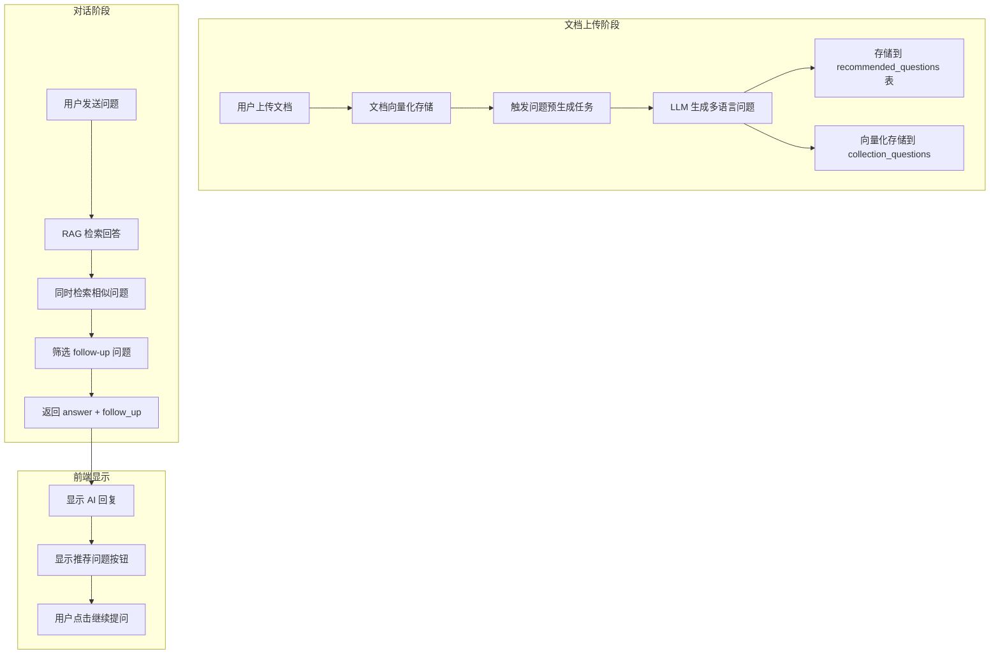

# ChatMax 推荐问题（Follow-up Questions）实现方案

## 当前实现状态

您的项目已经有了推荐问题功能的完整框架（1.3.0版本）：

### 后端模块

| 文件 | 功能 |
|------|------|
| [`backend_py/question_generator.py`](backend_py/question_generator.py) | 基于知识库文档使用 LLM 预生成多语言问题 |
| [`backend_py/question_retriever.py`](backend_py/question_retriever.py) | 基于向量相似度检索与用户问题相关的 follow-up |
| [`backend_py/app.py`](backend_py/app.py) | API 端点 `/api/chat` 和 `/api/chat/stream` 调用推荐问题 |

### 前端实现

[`src/components/ChatInterface.tsx`](src/components/ChatInterface.tsx) 第 98-100 行已实现 `followUpQuestions` 状态和显示逻辑。

### 数据库表

[`supabase/migrations/20260123000000_add_recommended_questions.sql`](supabase/migrations/20260123000000_add_recommended_questions.sql) 定义了 `recommended_questions` 表。

---

## 架构流程图



---

## 当前问题诊断

根据 CHANGELOG 记录，`recommended_questions` 表可能为空。需要检查：

1. 问题预生成任务是否在文档上传时被触发
2. 向量集合 `{collection}_questions` 是否有数据
3. 检索逻辑是否正常工作

---

## 实现步骤

### 步骤 1：确保数据库表已迁移

运行 Supabase 迁移，确保 `recommended_questions` 表存在。

### 步骤 2：在文档上传后触发问题生成

需要在文档上传 API（如 `/api/upload` 或文档处理完成后）调用问题生成任务：

```python
from question_generator import async_generate_questions

# 在文档处理完成后触发
asyncio.create_task(async_generate_questions(kb_id, collection_name, doc_id))
```

### 步骤 3：验证问题检索逻辑

确保 `question_retriever.py` 中的向量检索正确配置：
- 集合名称格式：`{原collection}_questions`
- 相似度阈值：`QUESTION_SIMILARITY_THRESHOLD=0.7`

### 步骤 4：API 端点已支持

[`backend_py/app.py`](backend_py/app.py) 第 768-788 行已在 `/api/chat` 中调用 `get_recommended_questions` 并返回 `follow_up` 字段。

### 步骤 5：前端显示已实现

[`src/components/ChatInterface.tsx`](src/components/ChatInterface.tsx) 第 1458-1484 行已实现推荐问题的显示：

```tsx
{!isTyping && followUpQuestions.length > 0 && messages.length > 0 && (
  <motion.div className="ml-11 space-y-2 mt-4">
    <p className="text-xs text-gray-500">{t('followUpQuestions')}</p>
    {followUpQuestions.slice(0, 3).map((question, index) => (
      <motion.button onClick={() => handleRecommendedQuestionClick(question)}>
        {question}
      </motion.button>
    ))}
  </motion.div>
)}
```

---

## 需要完善的关键点

1. **问题预生成触发**：当前缺少在文档上传后自动触发问题生成的逻辑
2. **异步任务调度**：可使用 Cloud Tasks 或后台线程处理生成任务
3. **手动生成入口**：添加 API 端点供管理员手动触发问题生成
