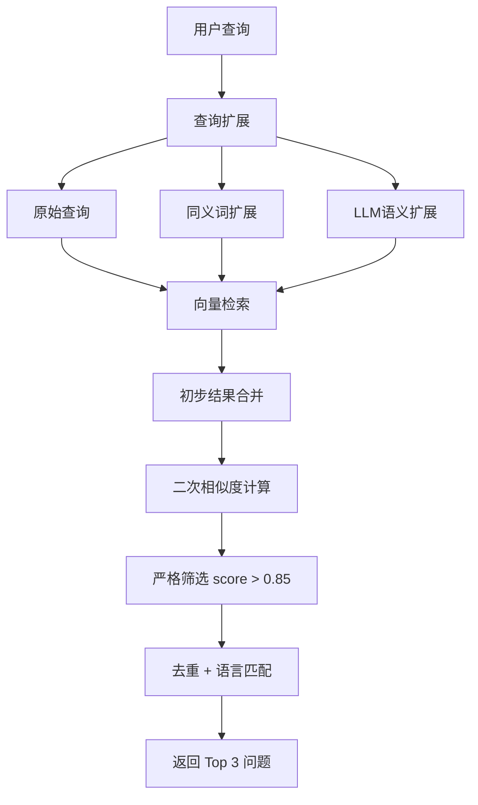

# Follow-up 推荐问题相关性优化方案

## 问题分析

当前 follow-up 问题与用户提问相关性不高，原因：
1. 相似度阈值过低（0.7）
2. 缺少二次相似度验证
3. 单一查询检索，容易遗漏相关问题

## 优化架构



---

## 实现步骤

### 步骤 1：提高相似度阈值

修改 [`backend_py/question_retriever.py`](backend_py/question_retriever.py)：

```python
# 原来
SIMILARITY_THRESHOLD = float(os.getenv("QUESTION_SIMILARITY_THRESHOLD", "0.7"))

# 改为
SIMILARITY_THRESHOLD = float(os.getenv("QUESTION_SIMILARITY_THRESHOLD", "0.85"))
```

### 步骤 2：增加二次相似度验证

在 `filter_follow_up_questions()` 函数中添加二次验证逻辑：

```python
from numpy import dot
from numpy.linalg import norm

def cosine_similarity(a, b):
    return dot(a, b) / (norm(a) * norm(b))

async def filter_follow_up_questions_v2(
    similar_questions: List[Dict],
    user_query: str,
    user_query_embedding: List[float],  # 新增
    question_embeddings: Dict[str, List[float]],  # 新增
    language: str = "zh",
    limit: int = 3,
    similarity_threshold: float = 0.85
) -> List[str]:
    # 二次相似度计算
    for item in similar_questions:
        question = item.get("question", "")
        if question in question_embeddings:
            item["verified_score"] = cosine_similarity(
                user_query_embedding,
                question_embeddings[question]
            )
    
    # 只保留验证分数 > 阈值的问题
    filtered = [q for q in similar_questions if q.get("verified_score", 0) > similarity_threshold]
```

### 步骤 3：添加查询扩展模块

创建新文件 [`backend_py/query_expander.py`](backend_py/query_expander.py)：

```python
"""查询扩展模块 - 参考 ChatMax 的 query_expand.py"""

async def expand_query(
    query: str,
    language: str = "zh",
    use_synonyms: bool = True,
    use_llm: bool = True
) -> List[str]:
    """
    扩展用户查询，生成多个相关查询用于检索
    """
    expanded_queries = [query]  # 原始查询
    
    # 1. 同义词扩展（简单版：使用 LLM 生成同义表达）
    if use_synonyms:
        synonyms = await generate_synonyms(query, language)
        expanded_queries.extend(synonyms)
    
    # 2. LLM 语义扩展（生成相关问题）
    if use_llm:
        related = await generate_related_queries(query, language)
        expanded_queries.extend(related)
    
    return list(set(expanded_queries))[:5]  # 最多5个
```

### 步骤 4：更新检索逻辑

修改 `get_recommended_questions()` 函数：

```python
async def get_recommended_questions(
    query: str,
    collection_name: str,
    language: str = "zh",
    limit: int = 3
) -> List[str]:
    # 1. 查询扩展
    expanded_queries = await expand_query(query, language)
    
    # 2. 对每个扩展查询进行检索
    all_similar_questions = []
    for expanded_query in expanded_queries:
        results = await retrieve_similar_questions(
            query=expanded_query,
            collection_name=collection_name,
            language=language,
            limit=limit * 2
        )
        all_similar_questions.extend(results)
    
    # 3. 去重并获取 embeddings
    unique_questions = deduplicate_questions(all_similar_questions)
    
    # 4. 计算原始查询的 embedding
    embeddings_model = OpenAIEmbeddings()
    user_embedding = embeddings_model.embed_query(query)
    
    # 5. 二次相似度验证
    question_embeddings = get_question_embeddings(unique_questions)
    
    # 6. 严格筛选
    follow_up = await filter_follow_up_questions_v2(
        similar_questions=unique_questions,
        user_query=query,
        user_query_embedding=user_embedding,
        question_embeddings=question_embeddings,
        language=language,
        limit=limit,
        similarity_threshold=0.85
    )
    
    return follow_up
```

---

## 涉及修改的文件

| 文件 | 修改内容 |
|------|----------|
| [`backend_py/question_retriever.py`](backend_py/question_retriever.py) | 提高阈值、添加二次验证、更新检索逻辑 |
| `backend_py/query_expander.py` | 新建：查询扩展模块 |
| [`backend_py/app.py`](backend_py/app.py) | 无需修改（接口不变） |

---

## 配置项

```bash
# .env.local 新增/修改
QUESTION_SIMILARITY_THRESHOLD=0.85  # 提高阈值
QUERY_EXPANSION_ENABLED=true        # 启用查询扩展
QUERY_EXPANSION_LLM_MODEL=gpt-4o-mini  # 扩展用的模型
```

---

## 预期效果

- follow-up 问题与用户查询高度相关（相似度 > 0.85）
- 通过查询扩展覆盖更多语义相关的问题
- 二次验证确保返回的问题质量