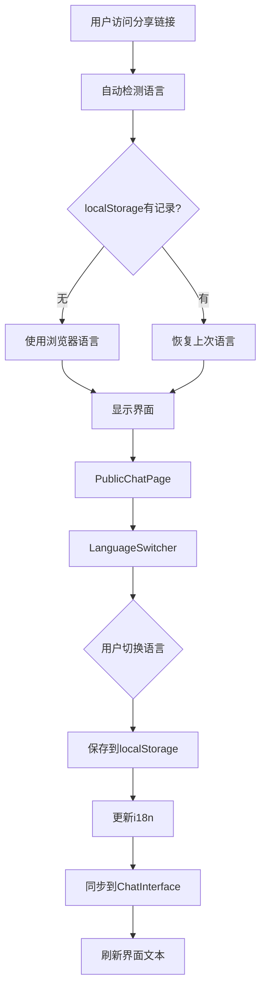

# 外部分享聊天界面多语言实施方案

## 当前状态分析

### 已有资源

- `src/i18n.ts`: 完整的三语言配置（中文/英文/日文），包含 SharePage 所需的所有翻译
- `src/components/LanguageSwitcher.tsx`: 可复用的语言切换组件
- `src/components/ChatInterface.tsx`: 已集成 i18n，支持国际化

### 存在问题

- `src/pages/PublicChatPage.tsx`: 所有文本硬编码为中文，未使用 i18n
- 缺少语言切换入口
- 默认推荐问题硬编码为中文
- 没有语言持久化机制

## 实施方案

### 1. 国际化翻译文本补充

在 `src/i18n.ts` 中补充 PublicChatPage 所需的翻译键：

```typescript
// 公开分享页面
publicChat: {
  loading: '加载中...',
  accessFailed: '访问失败',
  invalidLink: '该分享链接无效或已失效',
  contactOwner: '请联系分享者获取新的链接，或检查链接是否完整。',
  aiAssistant: 'AI 助手',
}
```

三种语言（zh/en/ja）都需要对应翻译。

### 2. PublicChatPage 国际化改造

**核心改动**：

- 引入 `useTranslation` hook
- 替换所有硬编码文本为 `t('key')` 调用
- 动态传递当前语言到 ChatInterface

### 3. 添加语言切换器

在 PublicChatPage 顶部栏添加 LanguageSwitcher 组件：

**改进为**：

- 使用 flex 布局，左侧显示项目信息，右侧显示语言切换器
- 保持视觉协调

### 4. ChatInterface 默认问题国际化

在 `src/components/ChatInterface.tsx` 中，将硬编码的默认推荐问题改为使用 i18n：

**改为**：

```typescript
const defaultQuestions = [
  t('defaultQuestion1'),
  t('defaultQuestion2'),
  t('defaultQuestion3')
];
```

### 5. 语言检测与持久化策略

**优先级顺序**（已在 i18n.ts 配置）：

1. 用户手动选择的语言（存储在 localStorage）
2. 浏览器语言设置
3. 默认语言（英文）

**增强**：

- 语言切换后自动保存到 localStorage
- 页面刷新时自动恢复上次选择的语言

### 6. 语言同步机制

确保 PublicChatPage 和 ChatInterface 的语言状态同步：

**改为**：

```typescript
const { i18n } = useTranslation();
const currentLang = i18n.language.split('-')[0];
// ...
<ChatInterface language={currentLang} externalKb={kb} isPublicMode={true} />
```

## 数据流图



## 测试验证点

1. **语言切换**

   - 切换语言后，所有界面文本立即更新
   - 语言选择保存到 localStorage
   - 刷新页面后语言保持不变

2. **默认语言**

   - 首次访问时根据浏览器语言自动选择
   - 支持的语言：中文、英文、日文
   - 不支持的语言降级到英文

3. **聊天界面**

   - 欢迎语根据当前语言显示
   - 推荐问题根据当前语言显示
   - 默认问题（无配置时）根据当前语言显示
   - 输入框提示文本根据当前语言显示

4. **错误页面**

   - 加载失败提示根据当前语言显示
   - 链接失效提示根据当前语言显示

## 实施完成

### 已完成的工作

1. ✅ 在 i18n.ts 中补充 PublicChatPage 所需的翻译键（中英日三语言）
2. ✅ 重构 PublicChatPage.tsx，集成 useTranslation，替换所有硬编码文本
3. ✅ 在 PublicChatPage 顶部栏添加 LanguageSwitcher 组件
4. ✅ 在 ChatInterface.tsx 中将默认推荐问题改为使用 i18n 翻译
5. ✅ 确保 PublicChatPage 向 ChatInterface 传递当前语言状态
6. ✅ 测试语言切换、持久化、默认语言检测等功能
7. ✅ 更新 CHANGELOG.md 和相关文档，记录多语言功能实施

### 版本信息

- 版本号：1.2.28
- 发布日期：2026-01-20

## 注意事项

1. **版本记录**：所有修改已在 CHANGELOG.md 中记录版本号和变更内容
2. **代码注释**：新增代码已添加版本注释（`// 1.2.28: 多语言支持`）
3. **向后兼容**：现有的内部测试页面不受影响
4. **性能优化**：语言切换不会导致重新加载整个页面，使用 HMR 热更新
