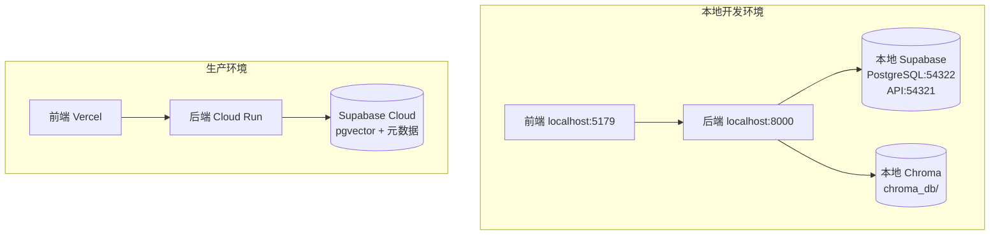

# 完全隔离本地开发环境计划

## 目标

实现本地开发环境与生产环境的完全隔离：



---

## 实施步骤

### 步骤 1: 启动本地 Supabase 实例

```bash
cd /Users/haya_ceo/Projects/Yuichat
supabase start
```

启动后会显示本地服务信息：

- **API URL**: `http://localhost:54321`
- **anon key**: 本地生成的 key
- **service_role key**: 本地生成的 key
- **Studio URL**: `http://localhost:54323`

### 步骤 2: 应用数据库迁移

```bash
supabase db reset
```

这会将 [`supabase/migrations/`](supabase/migrations/) 中的所有迁移应用到本地数据库。

### 步骤 3: 修改前端环境变量

编辑 [`.env.local`](.env.local)：

```env
# 本地 Supabase 配置
VITE_SUPABASE_URL=http://localhost:54321
VITE_SUPABASE_ANON_KEY=<从 supabase start 输出复制>

# 本地后端
VITE_PY_BACKEND_URL=http://localhost:8000
VITE_CHAINLIT_URL=http://localhost:8000
```

### 步骤 4: 修改后端环境变量

编辑 [`backend_py/.env.local`](backend_py/.env.local)：

```env
# 本地 Supabase 配置
SUPABASE_URL=http://localhost:54321
SUPABASE_ANON_KEY=<从 supabase start 输出复制>
SUPABASE_SERVICE_ROLE_KEY=<从 supabase start 输出复制>

# 使用本地 Chroma 向量数据库（完全隔离）
USE_PGVECTOR=false
# 注释掉或删除 PGVECTOR_DATABASE_URL

# 其他配置保持不变
OPENAI_API_KEY=sk-xxx
ENV=development
```

### 步骤 5: 重启服务

```bash
# 终端 1: 停止并重启后端
kill 82941  # 停止旧进程
cd /Users/haya_ceo/Projects/Yuichat/backend_py
source venv/bin/activate
python app.py

# 终端 2: 重启前端（需要重新加载环境变量）
cd /Users/haya_ceo/Projects/Yuichat
npm run dev
```

### 步骤 6: 创建本地测试用户

访问 http://localhost:54323 (Supabase Studio)，在 Authentication 中创建测试用户。

---

## 配置对比

| 配置项 | 本地开发 | 生产环境 |

|--------|----------|----------|

| 前端 | localhost:5179 | Vercel |

| 后端 | localhost:8000 | Cloud Run |

| Supabase URL | localhost:54321 | ppodcyocqhzrjqujdxqr.supabase.co |

| 向量数据库 | Chroma (本地文件) | pgvector (云端) |

| 用户数据 | 本地 PostgreSQL | 云端 PostgreSQL |

| 文件存储 | 本地 Storage | 云端 Storage |

---

## 环境切换

### 切换到本地环境

```bash
# 1. 启动本地 Supabase
supabase start

# 2. 确保 .env.local 配置指向本地
# VITE_SUPABASE_URL=http://localhost:54321

# 3. 确保 backend_py/.env.local 配置
# USE_PGVECTOR=false
# SUPABASE_URL=http://localhost:54321
```

### 切换到生产环境

```bash
# 1. 停止本地 Supabase（可选）
supabase stop

# 2. 修改 .env.local 指向云端
# VITE_SUPABASE_URL=https://ppodcyocqhzrjqujdxqr.supabase.co

# 3. 修改 backend_py/.env.local
# USE_PGVECTOR=true
# SUPABASE_URL=https://ppodcyocqhzrjqujdxqr.supabase.co
```

---

## 注意事项

1. **Docker 依赖**: `supabase start` 需要 Docker Desktop 运行
2. **首次启动较慢**: 第一次运行需要下载 Docker 镜像
3. **本地数据持久化**: `supabase stop` 不会删除数据，`supabase stop --no-backup` 会清除
4. **向量数据位置**: 本地 Chroma 数据存储在 `backend_py/chroma_db/`