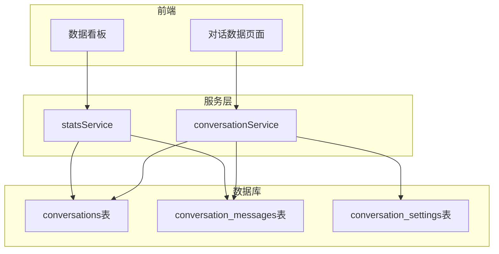

# 对话统计数据看板扩展计划

## 需求概述
- 区分测试对话（内部）与实际用户对话（外部分享）
- 记录高频提问并展示统计排行
- 按日期筛选对话记录
- 设置数据保存周期（永久、3个月、6个月、1年）
- 支持关键词搜索对话记录

---

## 架构设计



---

## 数据库设计

### 1. 扩展 conversations 表

在 [`supabase/migrations/`](supabase/migrations/) 创建新迁移文件：

```sql
-- 添加字段
ALTER TABLE conversations ADD COLUMN IF NOT EXISTS source_type TEXT DEFAULT 'test' CHECK (source_type IN ('test', 'public'));
ALTER TABLE conversations ADD COLUMN IF NOT EXISTS session_id TEXT;  -- 用于标识公开用户
ALTER TABLE conversations ADD COLUMN IF NOT EXISTS expires_at TIMESTAMPTZ;  -- 过期时间

-- 添加索引
CREATE INDEX IF NOT EXISTS idx_conversations_source_type ON conversations(source_type);
CREATE INDEX IF NOT EXISTS idx_conversations_session_id ON conversations(session_id);
CREATE INDEX IF NOT EXISTS idx_conversations_expires_at ON conversations(expires_at);
```

### 2. 新建对话设置表

```sql
CREATE TABLE IF NOT EXISTS conversation_settings (
    id UUID PRIMARY KEY DEFAULT gen_random_uuid(),
    knowledge_base_id UUID REFERENCES knowledge_bases(id) ON DELETE CASCADE NOT NULL UNIQUE,
    retention_period TEXT DEFAULT 'permanent' CHECK (retention_period IN ('permanent', '3_months', '6_months', '1_year')),
    created_at TIMESTAMPTZ DEFAULT NOW(),
    updated_at TIMESTAMPTZ DEFAULT NOW()
);
```

---

## 前端实现

### 1. 扩展数据看板 [`src/pages/DashboardPage.tsx`](src/pages/DashboardPage.tsx)

添加对话统计卡片：
- 总对话数（测试/公开分类）
- 总消息数
- 今日对话数
- 高频问题 Top 10 列表

### 2. 新建对话数据页面

创建 `src/pages/ConversationDataPage.tsx`，包含：
- 日期范围选择器
- 来源类型筛选（测试/公开/全部）
- 关键词搜索输入框
- 对话记录表格（问题、回复、时间、Session ID）
- 保存周期设置面板

### 3. 扩展侧边栏

在 [`src/components/Sidebar.tsx`](src/components/Sidebar.tsx) 添加"对话数据"菜单项路由。

### 4. 更新路由

在 [`src/App.tsx`](src/App.tsx) 添加 `/conversation-data` 路由。

---

## 服务层实现

### 1. 扩展对话服务 [`src/services/conversationService.ts`](src/services/conversationService.ts)

添加函数：
- `createPublicConversation()` - 创建公开对话（带 session_id）
- `listConversationsWithFilter()` - 带筛选条件的对话列表查询
- `searchConversations()` - 关键词搜索

### 2. 新建统计服务 `src/services/statsService.ts`

实现：
- `getConversationStats()` - 获取对话统计数据
- `getFrequentQuestions()` - 获取高频问题排行
- `updateRetentionPeriod()` - 更新保存周期设置

---

## 公开聊天页面修改

修改 [`src/pages/PublicChatPage.tsx`](src/pages/PublicChatPage.tsx) 和 [`src/components/ChatInterface.tsx`](src/components/ChatInterface.tsx)：
- 生成并存储 session_id（localStorage）
- 公开模式下保存对话记录到数据库（source_type='public'）

---

## 高频问题统计逻辑

使用数据库端聚合查询实现：
1. 提取用户消息（role='user'）
2. 使用 PostgreSQL 的 `similarity()` 函数或简单分词统计
3. 按相似度分组统计出现次数
4. 返回 Top N 结果

---

## 文件变更清单

| 文件 | 操作 |
|------|------|
| `supabase/migrations/20260125000000_add_conversation_analytics.sql` | 新建 |
| `src/pages/DashboardPage.tsx` | 修改 |
| `src/pages/ConversationDataPage.tsx` | 新建 |
| `src/services/conversationService.ts` | 修改 |
| `src/services/statsService.ts` | 新建 |
| `src/components/Sidebar.tsx` | 修改 |
| `src/pages/PublicChatPage.tsx` | 修改 |
| `src/components/ChatInterface.tsx` | 修改 |
| `src/App.tsx` | 修改 |
| `src/i18n.ts` | 修改（添加翻译） |