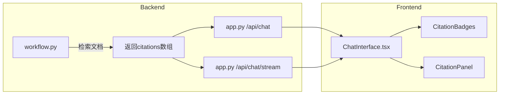

# 测试对话引用来源展示功能实施计划

## 核心需求

1. 在AI回答下方展示来源文档标签（类似ChatMax的badges）
2. 右侧展示引用来源详情面板
3. 只展示相关度最高的文档片段，而非全部内容

## 架构设计



## 实施步骤

### 1. 后端修改 - 返回检索文档信息

**文件**: [`backend_py/workflow.py`](backend_py/workflow.py)

修改 `chat_node` 和 `chat_node_stream` 函数：
- 在检索文档时保留文档的元数据（id, source/url, content片段, score）
- 将 citations 数组添加到返回的 state 中

当前检索逻辑只返回 context 字符串，需要同时返回结构化的 citations 数组：

```python
citations = []
for record in results:
    citations.append({
        "id": record[0],
        "source": metadata.get("source", ""),
        "content": text[:500],  # 只取前500字符
        "score": record[1] if len(record) > 1 else None
    })
```

**文件**: [`backend_py/app.py`](backend_py/app.py)

修改 `/api/chat` 和 `/api/chat/stream` 端点：
- 从 workflow 结果中提取 citations
- 在响应中返回 citations 数组

### 2. 前端修改 - 消息引用标签

**文件**: [`src/components/ChatInterface.tsx`](src/components/ChatInterface.tsx)

在AI消息气泡下方添加引用标签展示：
- 显示"文档：来源于N个文档"的标签
- 点击标签可展开/选中查看详情
- 使用已有的 `message.citations` 字段

### 3. 新建引用来源面板组件

**新文件**: `src/components/CitationPanel.tsx`

创建右侧引用详情面板：
- 固定在右侧的可折叠面板
- 展示选中引用的详情：来源URL、相关文档片段
- 按相关度排序，只展示Top 3-5个最相关的片段
- 每个片段限制显示字数（如500字）

### 4. 布局调整

修改 [`ChatInterface.tsx`](src/components/ChatInterface.tsx) 布局：
- 当有引用来源时，右侧显示 CitationPanel
- 使用 flex 布局，主聊天区域自适应宽度

## 关键实现细节

### 引用数据结构

```typescript
interface Citation {
  id: string;           // 文档片段ID
  source: string;       // 来源URL或文件名
  content: string;      // 文档片段内容（限制500字）
  score?: number;       // 相关度分数
}
```

### 相关度过滤逻辑

后端在返回 citations 时：
1. 按 score 降序排序
2. 只返回前5个最相关的文档片段
3. 每个片段内容限制在500字符以内

### 前端展示优化

- 引用标签使用 Badge 组件，显示序号
- 点击标签高亮对应的右侧面板内容
- 面板可折叠，默认展开
