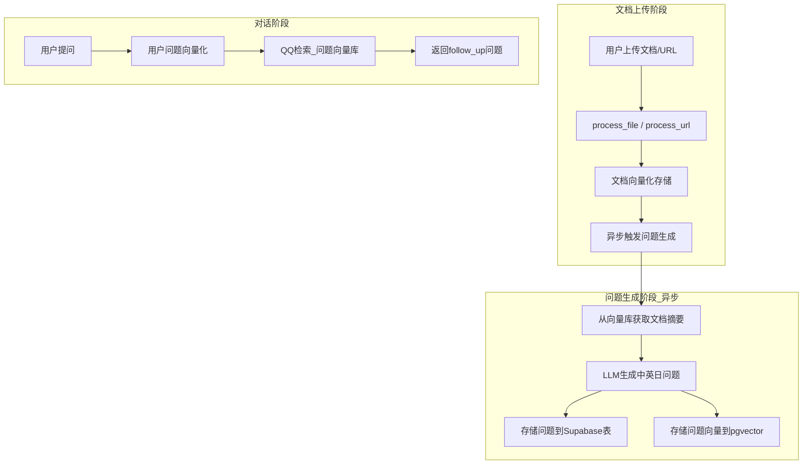

# Yuichat 推荐问题离线预计算方案

## 架构设计



## 一、数据库表设计

新建 `recommended_questions` 表存储预生成的问题：

```sql
-- 文件: supabase/migrations/20260123000000_add_recommended_questions.sql
CREATE TABLE recommended_questions (
    id UUID PRIMARY KEY DEFAULT gen_random_uuid(),
    knowledge_base_id UUID REFERENCES knowledge_bases(id) ON DELETE CASCADE,
    document_id UUID REFERENCES documents(id) ON DELETE CASCADE,
    question TEXT NOT NULL,
    language TEXT NOT NULL CHECK (language IN ('zh', 'en', 'ja')),
    source_type TEXT DEFAULT 'section' CHECK (source_type IN ('section', 'summary')),
    source_ids TEXT,  -- 生成问题的文档片段ID
    embedding_id TEXT,  -- pgvector中的向量ID
    is_active BOOLEAN DEFAULT true,
    created_at TIMESTAMPTZ DEFAULT NOW()
);

CREATE INDEX idx_rq_kb_id ON recommended_questions(knowledge_base_id);
CREATE INDEX idx_rq_language ON recommended_questions(language);
CREATE INDEX idx_rq_active ON recommended_questions(is_active);
```

## 二、核心代码实现

### 1. 问题生成模块

新建 [`backend_py/question_generator.py`](backend_py/question_generator.py) - 核心问题生成逻辑：

```python
# 关键功能：
# 1. generate_questions_from_docs() - 基于文档片段生成多语言问题
# 2. store_questions_to_db() - 存储到Supabase表
# 3. store_questions_to_vector() - 存储到pgvector向量库
# 4. async_generate_questions() - 异步任务入口
```

**LLM Prompt模板**（参考ChatMax）：

```python
QUESTION_GENERATION_PROMPT = """### 角色能力 ###
你是一个问题生成器，根据下面的上下文分别用中文、英文和日文生成{num}个不同且简洁的问题。
要求：问题要具体、实用、口语化，确保能从文档中找到答案。

### 上下文 ###
{context}

### 返回格式 ###
{{"questions": {{"zh": ["问题1", "问题2"], "en": ["Q1", "Q2"], "ja": ["質問1", "質問2"]}}}}
"""
```

### 2. 异步任务触发

修改 [`backend_py/app.py`](backend_py/app.py) 的 `/api/process-file` 和 `/api/process-url` 端点：

```python
# 在文件处理完成后，异步触发问题生成
import asyncio
from question_generator import async_generate_questions

@fastapi_app.post("/api/process-file")
async def process_file(request: Request):
    # ... 现有的文件处理逻辑 ...
    
    # 异步触发问题生成（不阻塞上传响应）
    asyncio.create_task(
        async_generate_questions(
            kb_id=kb_id,
            collection_name=collection_name,
            doc_id=doc_id
        )
    )
    
    return JSONResponse(content={"status": "success", ...})
```

### 3. 问题检索服务

新建 [`backend_py/question_retriever.py`](backend_py/question_retriever.py) - 语义检索推荐问题：

```python
# 关键功能：
# 1. retrieve_similar_questions() - 从向量库检索相似问题
# 2. filter_follow_up_questions() - 筛选follow_up问题（排重、语言匹配）
# 3. get_recommended_questions() - 综合接口
```

### 4. 更新对话API

修改 [`backend_py/app.py`](backend_py/app.py) 的 `/api/chat` 和 `/api/chat/stream` 端点，返回 `follow_up` 问题：

```python
# 在生成答案后，检索相关推荐问题
from question_retriever import get_recommended_questions

follow_up_questions = await get_recommended_questions(
    query=query,
    collection_name=collection_name,
    language=language,
    limit=3
)

return JSONResponse(content={
    "status": "success",
    "answer": answer,
    "follow_up": [{"content": q} for q in follow_up_questions]  # 新增
})
```

## 三、修改涉及的文件

| 文件 | 操作 | 说明 |

|------|------|------|

| `supabase/migrations/20260123000000_add_recommended_questions.sql` | 新建 | 推荐问题表 |

| `backend_py/question_generator.py` | 新建 | 问题生成核心模块 |

| `backend_py/question_retriever.py` | 新建 | 问题检索模块 |

| `backend_py/app.py` | 修改 | 集成异步生成和检索 |

| `backend_py/workflow.py` | 修改 | 可选：摘要生成支持 |

## 四、实施优先级

1. **Phase 1 (核心)**：数据库表 + 问题生成模块 + 异步触发
2. **Phase 2 (检索)**：向量检索 + follow_up返回
3. **Phase 3 (优化)**：缓存机制 + 多源融合（QQ/QS/QD）

## 五、与现有功能的关系

- `/api/frequent-questions` 端点保持不变，作为后备方案
- 新的 `follow_up` 问题通过 `/api/chat` 返回，前端需要适配显示
- 预生成问题减少实时LLM调用，提升响应速度